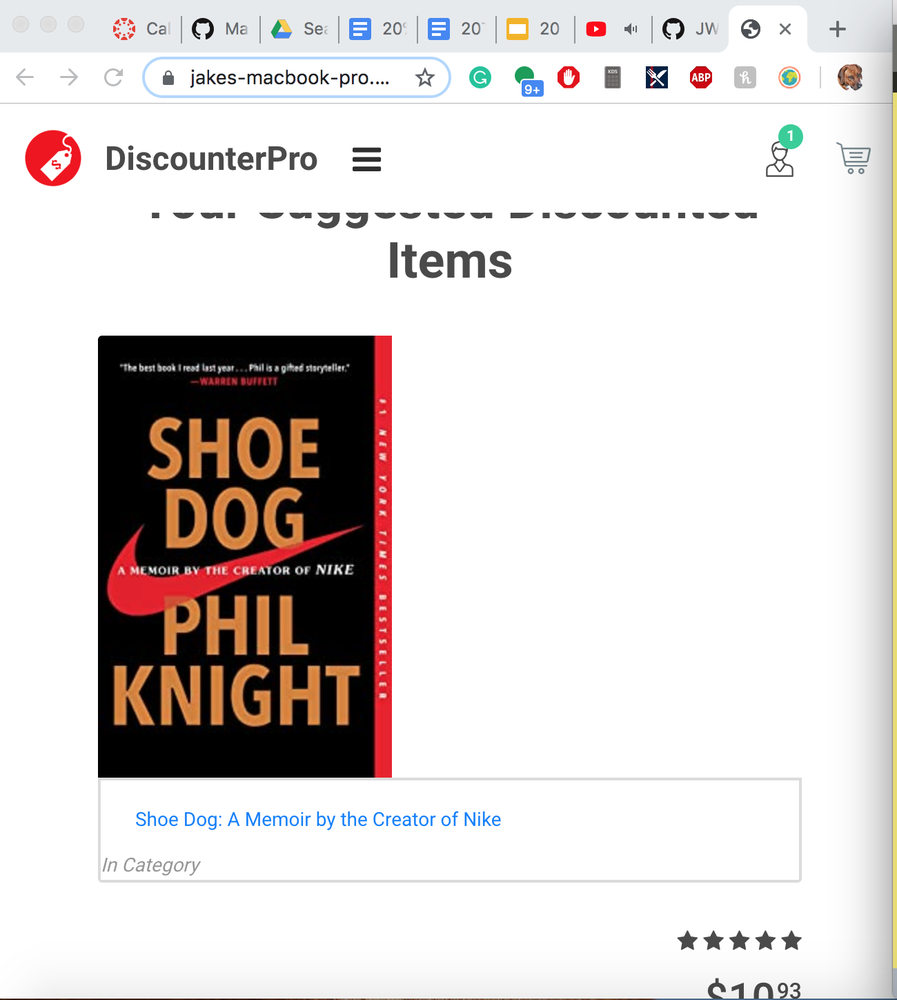
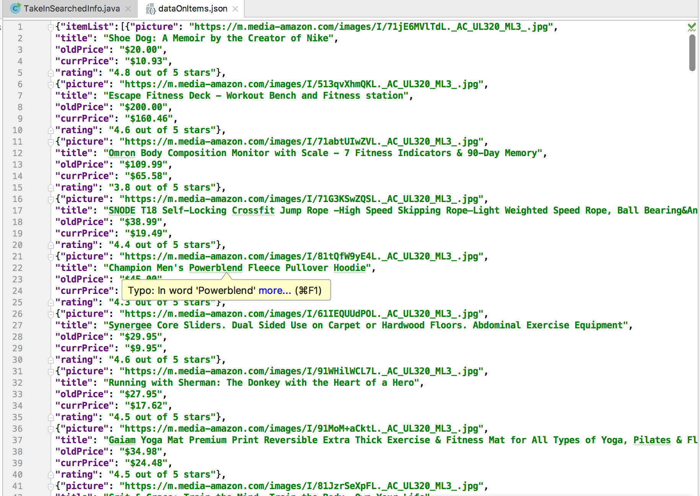

# DiscounterPro
# 20time project 1

## File Purposes: 

### Build:
	The File that, along with the src, contains all of the files that from my project.  
#### category.html
	A file that I did not use/modify in my project, yet that I think could have some cool applications that I could add onto later so I decided to keep it.
#### images
	Contains the images and logos used in the website
#### index.html
	The primary page which is loaded when the website is opened. This contains my javascript code and pretty much all of the HTML
#### js
	Javascript folder which contains the javascript used by the template 
#### plugins
	plugin folder used in the template, I havent touched this folder
#### product.html
	Another file I thought has potential, it is the screen that opens when you click on the product, I could either have the link go directly to the amazon page or go to this product.html section.
#### styles
	Contains all of the CSS styling 
#### Webscraping 
	My folder containing all of the java code and the JSON file that is read in by the javascipt 
##### dataOnitems.json
	JSON file that all of the data on the items is stored in. 
##### src
	contains all of the java files from when I was testing out possible methods of webscaping. The only one I use currently is the TakeInSearchedInfo.java file which is the one that actually uses jsoup to webscrape and take in/write the data to the JSON file. 
##### out
	output folder
##### lib
	Contains the jsoup library

### src:
	All of the same methods as the Build folder 

### config.codekit3
	config folder for codekit and the server its running 

Instructions: 

1. Download the actual code from Github
2. Download the jsoup library by:
	1. Opening IntelliJ (Jsoup is compatible with other IDE’s but this is the one I used)
	2. Click file → project structure → libraries → the + button → From Maven button 
	3. In the search bar, type org.jsoup:jsoup:1.12.1
	4. Check the download to Users/… checkbox, apply changes and hit ok
3. In order for some of the code to work it needs to be run on a server, therefore you have to run a local server of some kind. To download the one I’m using: 
	1. Go to https://codekitapp.com/ and click “download the app” 
	2. Add the 20timeproject to projects in codekit
	3. Go to settings → project settings → building process 
	4. Check the “This project uses a build folder” button 
	5. Set the Build folder name to build and the source Folder name to src

Successful run for reference: 

Remaining bugs/ unimplemented features: 

First and foremost, the formatting of the items on the website needs to be fixed up so that it is in rows of 3 items, the size of the pictures lines up with the adjacent box, and so that it looks more like the original template in general (I’m not sure what I did to mess it up.) Next, I will need to make it so my Java code also takes in the items URL address, which shouldn’t be too hard. Then I need to finish making it so the search box and whatever is inputted to it will be added to the interest list. Finally, I need to connect the interests section to the java code and have it run alongside the website; I will most likely do this through the use of an applet. 
I would also like to add to the products.html section but this was a lower priority. 

